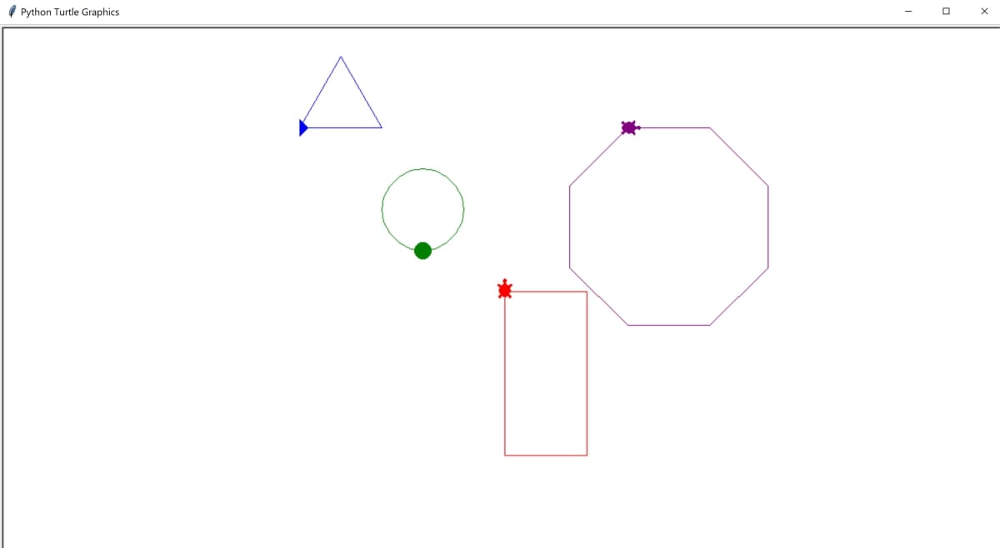

# create-shapes-using-turtles
This is an example python file that draws shapes using turtles.

## To Run

* Navigate to the python-turtles folder in the command line or terminal.
* Run the script using the python command: `python shapes.py`

## Example

